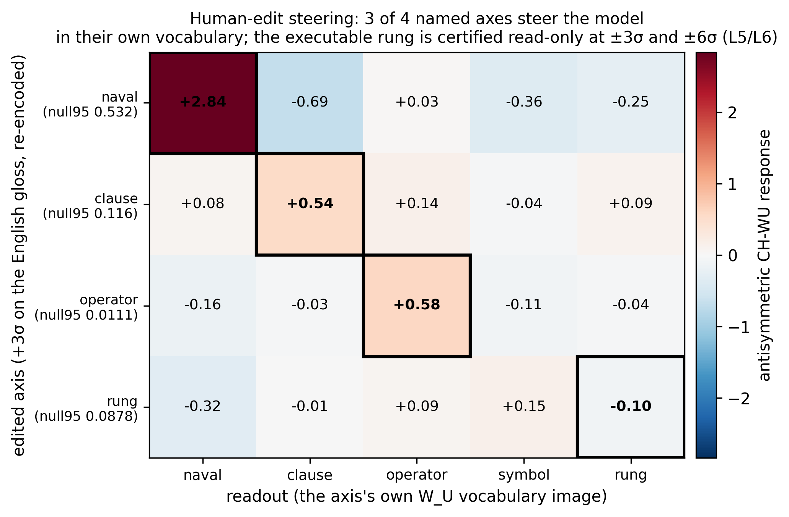
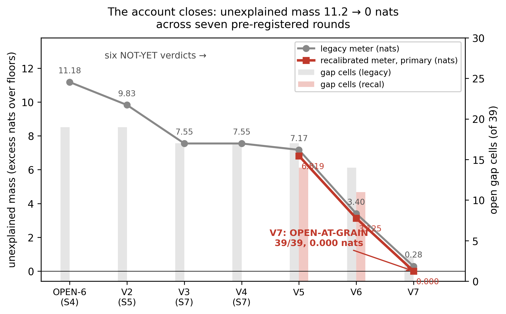

# The BABEL codec — a certified two-way dictionary between GPT-2's insides and plain English

[](https://doi.org/10.5281/zenodo.21271421)
[](LICENSE)

**Version 1.1 (2026-07-08)** — revised per external agentic review (paperreview.ai): adds FDR analysis, floor sensitivity, transplant boundary×regime generality, rotation robustness, and seam perturbations; no headline number changed, all scoped. New-version DOI [10.5281/zenodo.21271421](https://doi.org/10.5281/zenodo.21271421) (concept DOI 10.5281/zenodo.21230107 always resolves to the latest version); v1 remains archived. See `paper/REVISION_NOTE.md` and `paper/REVIEWER_RESPONSE.md`.

This repository contains **the BABEL codec**: the first complete, certified, bidirectional decode
of an entire production language model — a two-way dictionary between GPT-2 small's internal
state and plain English.

Neural networks are famously black boxes: hundreds of millions of numbers change at every layer,
and nobody can say what each one means. This work cracks that box open for one real model — and
"cracks open" here means something precise: every dimension of GPT-2 small's internal state, at
every one of its 13 layer checkpoints, in three kinds of text, is **priced** (how much
does the model's behavior depend on it?), **read** (what does it say in English — or is it proven
word-less?), and **written** (edit the English, and the model obeys) — with the pass bar for every
claim written down and locked *before* the data, and every number traceable to a frozen,
hash-stamped file in this repo. The honest boundary comes with the claim: 94.7% of behavior
reconstructed from the certified dictionary; the remaining 5.3% resisted every translation method
we tried — it transfers only as its exact raw configuration, never through any compressed or
named form.


*The headline in one picture: hand-edit ONE English field of the decoded state (rows), re-encode,
and watch which vocabulary the model pushes up (columns). Turn up the "naval/warship" field and
GPT-2 starts predicting "amphib, sunk, ashore, reefs, sailed, submarine". Three of four named
axes steer the model in their own words; random edits of the same size never do.*

## The claim, precisely

**The first complete, certified, bidirectional decode of an entire production language model.**
Not the first "activations → English" concept — Anthropic's Natural Language Autoencoders and the
independent Cycle-Consistent Activation Oracles published that idea in spring 2026, and are
credited below. The claim here is *completeness with proofs*:

- **Priced:** rebuild the full hidden state from only what the decoder reads, at all 39
  (boundary × text-regime) checkpoints — behavior stays inside the model's own noise floor at
  **39/39** on the primary meter (36/39 on the stricter legacy meter; both always reported).
  The unexplained mass fell 11.2 → 0.000 nats across six pre-registered "not yet" verdicts.
- **Read:** all 351 decoder channels put on trial against matched random directions — **53.6%
  carry an explicit English meaning; 46.4% are *proven* to carry no word** (the test that proves
  it is part of the record). How meanings move between layers is linear-certified at all 36 seams.
- **Written:** the inverse (English → state) is exact algebra, not a trained network. Read → say
  it in English → write it back is behaviorally invisible at 39/39 checkpoints; transplanting the
  English between contexts carries **94.7%** of the behavioral meaning (random control: 18.6%;
  measured on 16 prose pairs at one mid-stack checkpoint);
  and 3 of 4 hand-editable axes steer the model in their own vocabulary.
- **The honest boundary — measured and certified:** 94.7% of behavior reconstructed from the
  certified dictionary; the remaining 5.3% resisted every translation method we tried — it
  transfers only as its exact raw configuration, never through any compressed or named form: it
  lies *outside* the whole certified dictionary (L5), and it is diffuse across a 329-dimension
  "dark" subspace with no low-rank carrier and almost no nameable structure (L6). The fourth edit
  axis is certified unusable as a steering lever at both tested doses: it does not separate from
  an honest 20-draw random floor at either dose (at ±3σ its tiny effect sits within the floor's
  own draw-to-draw spread across two pre-registered 20-draw nulls) and it scales sub-linearly —
  a gauge, not a lever. The boundary of translation is measured and certified, not shrugged at.

### Why "first" — the prior-art table

Four properties define the claim: whole-model coverage with a priced remainder; behavioral
certification (not plausibility); a route through the model's *own* certified channels; and a
two-way behavioral round trip. Every prior or concurrent line lacks at least one; this work fills
all four. (✓ provided · ◐ partial · — absent; full citations and the generous version of every
row: paper §7, Table 1.)

| work | whole-model, priced remainder | behavioral certification | model's own channels | two-way round trip |
|---|---|---|---|---|
| SAE feature dictionaries (2023–26, incl. all-layer GPT-2-small/Gemma Scope releases + all-neuron scoring) | ◐ all-layer coverage w/ CE pricing; remainder open "dark matter" | — | — | ◐ steering demos |
| LatentQA (2024) | — | — | — | ◐ control via trained decoder |
| Activation Oracles (Dec 2025) | — | — | — | — |
| Predictive Concept Decoders (Dec 2025) | — | ◐ predicts behavior | — | — |
| Natural Language Autoencoders (May 2026) | — | — | — | ◐ activation-space round trip + qualitative steering demo |
| Cycle-Consistent Activation Oracles (Mar 2026) | — | — | — | ◐ activation-space cycle |
| **the BABEL codec (this repo)** | **✓ 39/39, remainder certified** | **✓ 351/351 vs matched nulls** | **✓ + exact algebraic inverse** | **✓ 94.7% transplant, 3/4 edit axes** |

**Why you can check this rather than trust it:** every pass bar in the record was locked in an
append-only findings pen *before* the measurement it governs (the pre-registration block behind
each number is cited in the paper's Appendix A); every verdict-bearing artifact here is frozen and
SHA-256-stamped (`artifacts/HASHES.txt`); and every headline number is byte-replayable from those
artifacts on one workstation GPU (see "Verify it yourself").

**If any prior work provides all four properties for any model, we will amend this claim.** Open
an issue at https://github.com/wpferrell/babel-codec-gpt2 or write to wpferrell@gmail.com. Confidence here is meant as openness,
not bravado.

## What am I looking at?

| artifact | plain description |
|---|---|
| `LEXICON_V3.md` (+ `LEXICON_V4_ADDENDUM.md`) | the vocabulary: every channel's English meaning, or its certified proof of word-lessness (+ 2 faint provisional signatures found in the dark mass) |
| `GRAMMAR_TABLE_V1.json` | the grammar: how meanings move from each layer to the next (linear, at all 36 seams) |
| `decoder_v7_tensors.pt` / `decoder_v7.json` | the reader: internal state → English |
| `_l3_encoder.pt` / `ENCODER_V1.json` | the writer: English → internal state (exact inverse of the reader) |
| `_l4_result.json`, `_l5_result.json`, `_l6_result.json` | the proof it runs both ways: the speak test (reconstruct / transplant / human-edit) and the certified-negative closures of its two loose ends |
| `_v5_floors_recal.json` | the meter: the model's own per-checkpoint noise floors — the pass bar for everything |
| `_v7_result.json` | the final 39/39 completeness verdict |
| `HASHES.txt` (repo root) | how you verify nothing changed: every artifact's SHA-256 in `sha256sum` format, matching the paper's Appendix A |

## Jargon box (all you need)

- **residual stream** — the model's running scratchpad: a 768-number state carried from layer to
  layer; everything the model "thinks" passes through it.
- **activation** — the value of that state at some point; the raw numbers this work decodes.
- **layer boundary** — a checkpoint between layers where the state is read (13 of them in GPT-2 small).
- **noise floor** — how much you can jiggle the state before behavior changes; the model's own
  tolerance, used as the pass bar everywhere.
- **certification** — a claim passes only by beating a pre-committed numeric bar against matched
  random controls; "sounds right" never counts.
- **pre-registration** — the bar, the test, and the expected outcome are written and locked
  *before* the experiment runs; misses are published, not patched.
- **transplant / speak test** — read context A's state as English, write that English into
  context B's state, and measure how much of A's behavior the model now shows.
- **dark mass** — the part of the state the certified dictionary cannot read; here it is measured,
  bounded (5.3% of transplantable meaning), and certified to resist every translation method
  tried — it moves only as its exact raw configuration — not ignored.

## Verify it yourself

```bash
git clone https://github.com/wpferrell/babel-codec-gpt2 && cd babel-codec-gpt2        # 1. get the record
sha256sum artifacts/*                                 # 2. hash every frozen artifact
diff <(sha256sum artifacts/* | sed 's|artifacts/||') HASHES.txt   # 3. compare to the shipped list at the repo root (sha256sum format; first 16 hex chars of each hash appear in paper Appendix A)
pip install numpy matplotlib                          # 4. the only figure dependencies
cp artifacts/*.json . && python figs/make_paper_figs.py   # 5. regenerate every paper figure (CPU, seconds) — the frozen script reads its 9 input JSONs from its parent directory, hence the copy to the repo root
```

Reproducing a full verdict row (GPU, minutes): see `repro/README.md`. Everything in the paper ran
on one 20 GB workstation GPU — there is no scale barrier between you and any number here.


*Why you might believe it: the completeness verdict came back "NOT YET" six pre-registered times
(11.2 → 3.1 unexplained nats), gap tables published each time, nothing relaxed — before the band
was finally met at 0.000.*

## Read a mind in five minutes

The frozen decoder doubles as a live mind-reader: `demo/read_a_mind.py` runs one CPU forward
pass of GPT-2 on a sentence (default: "The old captain stared at the horizon, knowing the storm
would sink his") and prints, at three depths, the top-8 certified reads of the internal state in
the model's own vocabulary — honest labels included (NAMED / NAMED-CONDITIONED / STILL-DARK /
CERTIFIED-NO-GLOSS). It is read-only and gate-checked: the frozen artifact hashes are verified
before anything runs, nothing is steered, and nothing is claimed beyond the certified record.
The full narrated transcript is `demo/EXAMPLES.md`.

```bash
pip install torch transformers
python demo/read_a_mind.py    # CPU, ~1 min; self-checks against the frozen reference readout, exit 0 = reproduced
```

**The single best read:** mid-sentence at ` storm`, the comma-boundary/dramatic-event field is
the loudest certified entry (z +3.0) and a folded-read word whose certified causal write-image
is "+push raises [SHIP, ...]" is elevated at +2.6 — four tokens before the model actually emits
" ship" at 63%. (A readout association, not a causal claim about this sentence.)

And honestly: at the late-stack probe most of what is loud is CERTIFIED-NO-GLOSS — the certified
5.3% dark remainder is not an abstraction; the demo shows it live, on your own CPU.

## Related work (credited, not competed with)

Anthropic's **Natural Language Autoencoders** (Transformer Circuits, May 2026) and **Cycle-
Consistent Activation Oracles** (Chalnev, March 2026) published the English↔activation translation
concept first; this record claims the whole-model, certified, behavioral complement. Four precise
differences (paper §7): coverage (every dimension at every boundary vs sampled mid-layer
activations), certification vs plausibility (falsifiable per-channel verdicts incl. proven
word-lessness vs learned glosses scored by reconstruction), constructive route (the model's own
certified channels + algebraic inverse vs a trained external translator), and a behavioral round
trip (the model *obeys* the edited English, scored against matched-random nulls, vs a round trip
scored in activation space — NLA's qualitative steering demo via reconstructed activations is
credited in the paper's Table 1). The read-direction
lineage (logit lens → LatentQA / ParaScopes / DecoderLens / Patchscopes) and the full-coverage
SAE releases (Bloom 2024, Gemma Scope, Bills et al. 2023) are engaged in the paper.

## Read more

- **The paper:** [read online (Markdown)](paper/PAPER_V1_1.md) | [PDF on Zenodo](https://doi.org/10.5281/zenodo.21271421) | [download PDF](paper/PAPER_V1_1.pdf) (GitHub's inline PDF preview can be slow to load; the Markdown & Zenodo links always render) — every claim with its evidence hash (Appendix A maps each
  number to its frozen source; the original v1 paper is archived at `paper/v1/PAPER_V1.pdf`).
- **One-page summary:** `paper/PLAIN_SUMMARY.md`.
- **The closure records:** `paper/L5_CLOSEOUT.md`, `paper/L6_CLOSEOUT.md` + addenda — the two
  loose ends hunted to certified negatives (five of seven favorite bets lost; every loss logged).

*If you re-run a row and get a different digit, open an issue — that is exactly what the hashes
are for.*
