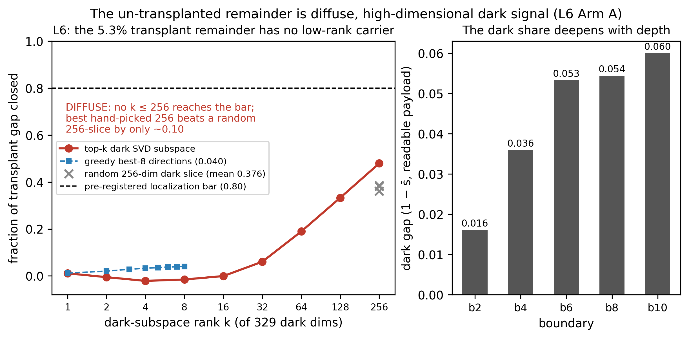
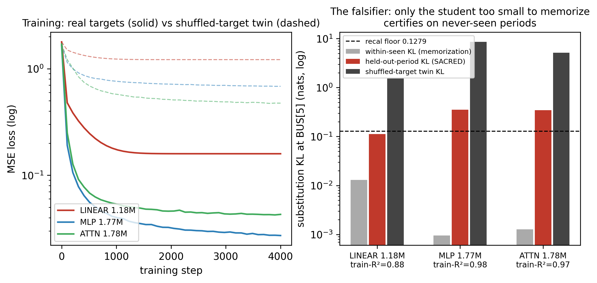
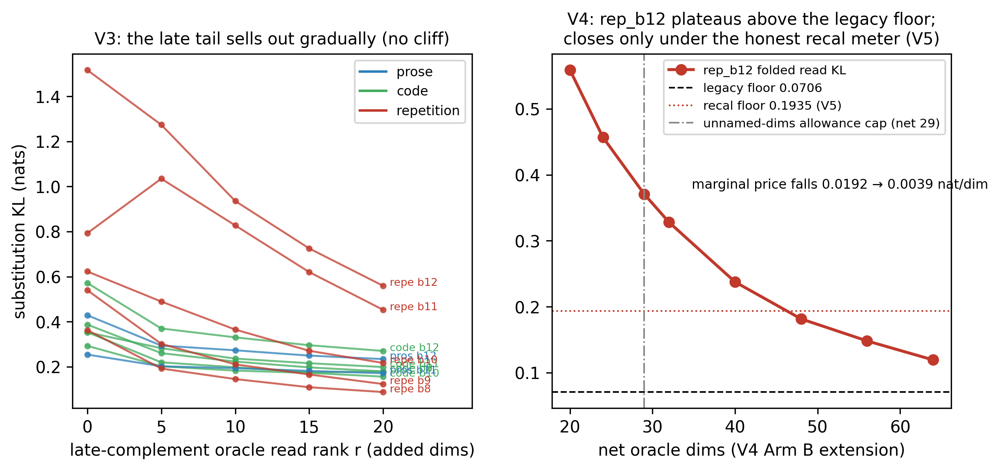
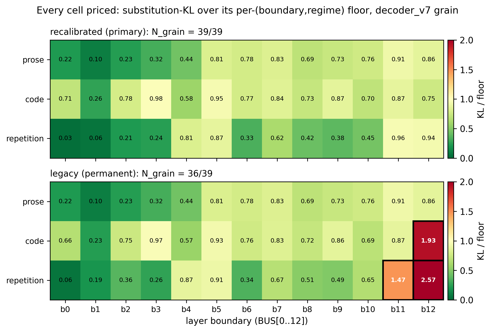

# A Complete, Certified Decode of a Production Language Model: Every Dimension of GPT‑2's State Space Priced, Named or Proven Word‑Less, and Spoken Back

**Will Ferrell** — Independent Researcher

*Draft v1, 2026‑07‑06 (L5 remainder‑closure and L6 dark‑mass/rung/anomaly closure incorporated same day) — not submitted; artifacts and hashes on request pending release.*

---

## Abstract

We present the first complete, certified, bidirectional decode of an entire production language
model: every dimension of GPT‑2's residual state space priced, named or proven word‑less, and spoken
back. On GPT‑2 (124M, fp32), across all 13 residual‑stream boundaries in three
text regimes (prose, code, repetition) — a 39‑cell battery — a decoder built from the model's own
certified channels replaces the full hidden state at every cell with behavior held at or under the
model's own per‑regime noise floor: 39/39 cells on the primary (norm‑relative) meter — ratified
mid‑program under three pre‑registered sanity gates (§2) — 36/39 on the stricter legacy meter, with zero unexplained nats remaining on the primary meter
(down from 11.2 at the first verdict). Success is judged by *substitution* — forward KL against
pre‑registered floors — never by narrative, and the account survived six consecutive pre‑registered
NOT‑YET verdicts before the band was met. On top of the account sits a certified bidirectional
codec for GPT‑2's residual‑stream language (the BABEL codec):
every one of its 351 channels is adjudicated against sigma‑matched nulls — 53.6% carry an
explicit English gloss and 46.4% are *certified word‑less* (a tested outcome, not a gap); the
layer‑to‑layer composition of the named fields is linear‑certified at all 36 seam‑cells (12 seams ×
3 regimes); an exact algebraic inverse (gloss → state) is well‑posed at 39/39 cells; and the
language runs both ways behaviorally: read‑then‑re‑encode preserves behavior at 39/39 cells,
transplanting a read‑out gloss between contexts carries 94.7% of the next‑token behavioral gap
(matched‑random: 18.6%; 16 prose pairs at one mid‑stack boundary, §6.4) — with the residual 5.3%
*certified* to lie in un‑adjudicated dark mass
outside the entire certified channel set: adding the certified door channels to the transplant
closes exactly 0.0 more (§6.6), and *characterized* (§6.7): diffuse across the 329‑dim dark
complement (no subspace of rank ≤ 256 closes 80% of the gap; a random 256‑dim dark slice nearly
matches the best) and mostly word‑less (6 of its 8 largest carriers certified no‑gloss, the other
2 faintly nameable only through non‑vocabulary channels) — and hand‑editing single English fields
steers the model in that
field's own vocabulary for 3 of 4 named axes (the fourth, the executable "onset rung", is
certified *unusable as a steering lever at both tested doses*: its tiny onset effect — |A| ≈ 0.004
at ±3σ, ≈ 0.010 at ±6σ — clears no internal readout, does not separate from an honest N = 20
matched‑random floor at either dose (at ±3σ the effect sits inside the floor's own draw‑to‑draw
spread across two pre‑registered N = 20 draws, §6.6), and scales sub‑linearly, so pushing harder
buys nothing; one candidate certified listener, 2.8% over a
12‑draw multiplicity null, reads its output downstream, §6.6–6.7). The
hardest object — a layer‑5 repetition‑maintenance computation that defeated every read and every
circuit splice — is closed by a 1.18M‑parameter *linear* surrogate that certifies on never‑seen
repeat periods while higher‑capacity students fail the memorization falsifier. No prior or
concurrent work — the nearest being Anthropic's Natural Language Autoencoders and the
Cycle‑Consistent Activation Oracles line — provides all four of the claim's defining properties:
whole‑model coverage with a priced remainder, behavioral certification against matched nulls, a
constructive route through the model's own certified channels, and a bidirectional behavioral
round trip (§7, Table 1, adjudicates this row by row and commits to amending the claim should a
counterexample surface). All results were
produced and are reproducible on one workstation GPU; every claim carries an evidence hash.

---

## 1. Introduction

### 1.1 The question

Can the internal state of a production language model be *fully* accounted for — not sampled, not
illustrated by cherry‑picked features, but priced dimension by dimension at every depth, against a
bar the model itself sets — and can the accounted‑for part then be translated into English and back?

This paper answers that question for GPT‑2 124M at a defined grain: the residual stream ("bus") at
its 13 layer boundaries, in three text regimes. The answer is yes, with every caveat stated and
priced: yes at 39/39 boundary–regime cells on the primary meter (36/39 on the stricter legacy
meter, the 3 residual gaps being priced meter geometry, not model behavior); yes for translation
under a definition in which *"this channel provably carries no word"* counts as a completed,
tested translation outcome (46.4% of channels); and yes behaviorally, including a human‑edit tier
in which turning up a named "naval/warship" field makes the model predict *amphib, sunk, ashore,
reefs, sailed, submarine*.

### 1.2 What is new

Reading activations with language is no longer new: a lineage runs from logit‑lens‑style
projections through trained translators (LatentQA, ParaScopes, DecoderLens, Patchscopes), and, in
concurrent work published this spring, Anthropic's Natural Language Autoencoders (NLA) and the
Cycle‑Consistent Activation Oracles (CCAO) train verbalizer/reconstructor pairs that explain
single activations (§7). What has not existed is an *account*: a claim of the form "this is
everything, at this grain, and here is the bill for what resisted." Stated in its locked form, the
claim of this paper is that it is **the first complete, certified, bidirectional decode of an
entire production language model**. Four properties define that claim — whole‑model coverage with
a priced remainder, behavioral certification, a constructive route through the model's own
certified channels, and a bidirectional behavioral round trip — and they are exactly the first
four contributions below. §7 (Table 1) adjudicates every prior and concurrent line against all
four and states the standing commitment to amend the claim if any work is found to provide them.
The contributions:

1. **Completeness with a price.** Every one of 39 (boundary × regime) cells is priced by
   full‑state substitution against a pre‑registered per‑cell floor. The completeness score and the
   unexplained mass (in nats) are published per cell, on two meters, with the meter change itself
   pre‑registered, sanity‑gated, and reported on both sides (Fig. 1, Fig. 2).
2. **Certification rather than plausibility.** Every claim is a mechanical verdict against bands
   locked before measurement. Explanations are never scored by whether they sound right; channels
   that fail naming are published as CERTIFIED‑NO‑GLOSS — a first‑class result with, to our
   knowledge, no published analogue.
3. **A constructive route.** The decoder is assembled from subspaces certified as *necessary* on
   the model's own computation (doors, core fields, folded reads, executable rungs) — not from a
   trained external translator. Two of the headline results — the internal‑alphabet result (§4.4)
   and the 36/36 seam‑linearity law (§6.2) — are therefore claims about the *model*, not about a
   translator's competence.
4. **A behavioral round trip.** Translation quality is scored by what the model *does* after
   re‑encoding — substitution KL, cross‑context meaning transplant, and human edits of single
   English fields — with pre‑registered falsifiers and matched‑random nulls at every tier (§6.4).
5. **Negative results as method.** The account was reached through six consecutive pre‑registered
   NOT‑YET verdicts (§1.3), three certified impossibility results on one object (§5), a
   capacity‑hurts falsifier that caught its own would‑be false positives (§5.4), and one
   instrument bug caught by its own replay gate (§3.6). We argue this discipline is the paper's
   most transferable contribution.

### 1.3 The six NOT‑YETs, told as the method they are

The completeness hypothesis (H‑OPEN6‑a) was written once, with a band requiring all 39 cells at or
under floor, and an escalation rule binding the program to publish the gap table and stop —
relaxing nothing — whenever the band was missed. It was missed six times: at the campaign verdict
(19 gap cells, 11.2 excess nats), and at decoder rounds V2 (9.8), V3 (7.5), V4 (7.5), V5 (6.8),
and V6 (3.1). Each NOT‑YET is a dated, hash‑stamped record of exactly what remained dark and what
it cost; each round's attack was chosen from the previous round's gap table; and the verdict text
never changed. When the band was finally met at V7 — 39/39, zero unexplained nats, as the
pre‑registered 9% *underdog* outcome — the result inherited the credibility of the six honest
failures that preceded it. Figure 1 is this history. We commend the pattern: completeness claims
are cheap; completeness claims with six public prior refusals are not.

### 1.4 Scope, stated plainly

One model (GPT‑2 124M), one grain (boundary‑level residual state; within‑block mechanisms enter
only as attribution evidence), three regimes, floors defined by the model's own output sensitivity
to state noise. "Complete" always means *complete at this grain against these floors* — the
defined success criterion of the program, written before the data. §8 prices every scope edge.

---

## 2. Definitions: the state, the meter, the verdicts

**State.** `h_b(t)` is the 768‑dim residual state at boundary `b ∈ {0..12}` (BUS[0] = embedding
output; BUS[12] = final pre‑unembedding state), position `t`. All runs: fp32, eager attention,
TF32 off, fixed seeds.

**Regimes.** prose (WikiText, fresh token windows disjoint from all fit data), code (HumanEval
concatenation, fresh windows), repetition (seeded synthetic induction streams, period‑64 repeated
segments; held‑out seeds and periods reserved for falsifiers). Holdout per regime: 16×512 tokens.

**The meter (substitution).** At cell `(b, regime)`: capture clean logits on the holdout; rebuild
`ĥ_b` from decoder reads only; substitute `ĥ_b` for `h_b` in the forward pass; score forward KL
(clean ‖ substituted), in nats, averaged over positions (repetition rungs metered on the
repetition‑era positions, per the certified per‑cell convention). Identity substitution must be
*exact zero* (KL ≤ 1e‑9, max |Δlogit| ≤ 1e‑4) at every cell before any verdict is read — the
plumbing gate.

**Floors (two meters, both permanent).** A cell PASSES iff substitution KL ≤ its floor.
*Legacy:* per‑(boundary, regime) floors from matched noise injections (the J1 bank), anchored to
the prose cross‑seed ensemble floor `EPS_KL = 0.1871` nats (T6). *Recalibrated (primary):*
norm‑relative floors — the same noise construction scaled by the measured per‑cell state norm
(`_v5_floors_recal.json`, hash 71549ae3…) — adopted mid‑program under three pre‑registered sanity
gates: all 26 legacy floors replicated to the digit first; the early‑repetition floors (proven
genuine model physics, §5.1) were not allowed to relax; the wall cell was not allowed to pass by
bookkeeping. Both meters are reported everywhere; cells that pass only under recalibration are
labeled *meter corrections, not model discoveries*.

**The two completeness rungs.** `N_open`: cells passing with *zero* unnamed dimensions (named
fields + certified doors + token‑surface term only). `N_grain`: cells passing with at most 64
unnamed‑but‑located dimensions per boundary (the corridor and folded reads; the allowance
arithmetic is shown per cell). `N_grain = 39/39` is the program's pre‑written success criterion.

**Verdict discipline.** Every experiment is one pre‑registration block (gap‑scan, design, exact
bands, stated bet with odds, failure branches, budgets) locked in an append‑only pen before any
measurement, and one results block with mechanical verdicts. Bands may be sharpened, never
weakened; missed favorites are logged loudly (the record includes rounds where 0/5 favorites hit,
and rounds where 7/7 did).

---

## 3. The instrument: how the decoder was built and policed

### 3.1 The certified alphabet (what "the model's own channels" means)

The decoder's reads are subspaces certified as necessary at the model's noise floor, built up over
the program's instrument series (all pre‑registered; hashes in Appendix A):

- **Doors (Q_union, 385 dims ≈ 50% of d=768).** The minimal‑rank subspaces through which module
  groups must write to preserve behavior: joint attention‑writer door k\*≈128, MLP‑interior
  k\*≈240, union ≈385 — measured by restricting group writes to a rank‑k orthonormal basis and
  demanding KL ≤ floor. Per‑module necessity is ~1 dim; load pools at the group level.
- **The core (C, 19 dims).** The shared ensemble core of certified doors across cert sets:
  individuated (19/19 distinct), semantic (17/19 carry content classes), analog (0/19 discrete),
  load‑bearing (excising the 19 dims hurts more than ablating all 12 attention writes at once).
- **The front door (m0, k\*=13 prose / k\*=1 repetition).** MLP0's certified minimal write into
  MLP1 — the detokenization bottleneck; its single repetition‑era coefficient is one of the three
  inputs of the executable rungs (§5.4).
- **The corridor (Q35, 35 dims).** A boundary‑persistent dark object discovered as ~35 distinct
  directions recurring across the five biggest dark rooms (cross‑boundary direction matches to
  0.9999). Located first, named later: 26/35 now carry glosses (§6.1).
- **The token‑surface term (wte).** A ridge read from the current token's embedding to the
  content‑complement residual — the only *fitted* read in the entire named decoder, frozen with
  its hash. It completes the birth boundaries (§4.3) and provably does not help late (a
  pre‑registered null: surface ≠ late content).
- **Folded reads (O_r48, per‑cell).** Rank‑48 orthonormal reads of the residual complement at
  late/code cells, inside the ≤64 unnamed‑dims allowance (arithmetic shown per cell, 61–62 ≤ 64).
- **Executable rungs (S9x, 3 cells).** Where no static read suffices (rep b5/b6/b7), a printable
  ~1.18M‑parameter *linear* map computes the missing object from readable inputs {layer‑2 state,
  current token, m0's certified coefficient} and the decoder runs it (§5.4). The rungs are the
  only trained modules in the decoder, and they are certified by substitution on never‑seen repeat
  periods with a memorization falsifier.

### 3.2 The naming battery (how a channel earns a gloss, or is proven word‑less)

Each channel (corridor direction, core field, folded dim at ≥1% share) is snapped causally
(±1σ/±2σ at its top‑traffic positions) and judged on three response channels: its own
unembedding‑vocabulary image (CH‑WU), logit‑lens contrasts at downstream boundaries (CH‑INT), and
the antisymmetry of its downstream field response (CH‑FIELD). *Every* channel is judged against
sigma‑matched random nulls — random directions snapped at the same magnitude — and a gloss
requires stability in ≥2 of 3 regimes (regime‑specific naming allowed for folds, labeled).
Channels that fail *against the null* are CERTIFIED‑NO‑GLOSS: random directions of the same
loudness move the model *more*. The glitch axis b2_d0 is the canonical example: response dwarfed
by its own nulls on every channel (e.g., field response 0.87 vs null95 ≈ 118) — inert, not weak.
Below‑1% folded dims are certified collectively as noise‑floor residue (per‑cell share
0.065–0.191).

### 3.3 Null design (the three families)

*Sigma‑matched nulls* for naming (above); *matched‑random substitutions/edits* for behavioral
tiers (a random read/edit of the same per‑position norm, the discriminator for §6.4);
*shuffled‑target twins* for trained modules (an identical student trained on permuted targets —
any student that cannot beat its twin by the pre‑set factor is void). Where a control itself
carries a lesson (the operator axis, §6.4), the lost sub‑prediction is logged as a finding.

### 3.4 The falsifier culture

Held‑out repeat *periods* (not just positions) so a student that memorizes trajectories is caught;
the capacity‑hurts falsifier (higher‑capacity students must not be allowed to win by
memorization — and in fact they lose, §5.4); pre‑registered failure branches that fire as
contingencies, not weakenings; post‑hoc analyses labeled post‑hoc, opening questions rather than
closing them.

### 3.5 Byte‑replay gates

Every reused component must reproduce its banked anchors to the digit before its outputs are
trusted (12+ replay gates in a typical round; "0 instrument discrepancies" is a logged, checked
condition, not a phrase). The one instrument bug of the program's decoder week — vocabulary‑channel
nulls snapped at the wrong sigma — was caught by its own replay gate, diagnosed against the wrong
hypothesis first (that too is logged), and re‑run bounded with all 70 prior null quantiles
replayed to ≤ 5e‑5.

### 3.6 Reproducibility

Single GPU (NVIDIA RTX A4500, 20 GB): the seven decoder rounds cost 183.6 s – 4891.6 s GPU each;
the four BABEL‑codec stages 74.9 s – ~4600 s. Deterministic streams (exact token windows + seeds);
atomic checkpoints; every frozen artifact hash‑stamped (Appendix A); figures regenerate from the
frozen JSONs alone (paper_figs/make_paper_figs.py).

---

## 4. Results I — the account: 39/39 cells at or under the model's own floor

### 4.1 The verdict

**Fig. 1** (nat collapse) and **Fig. 2** (final heatmaps, both meters). At the V7 grain:

| meter | N_open | N_grain | gap cells | unexplained nats |
|---|---|---|---|---|
| recalibrated (primary) | 6/39 | **39/39** | **0** | **0.000** |
| legacy (permanent) | 6/39 | 36/39 | 3 | 0.283 |

The three legacy‑only gaps (rep_b11 1.47×, rep_b12 2.57×, code_b12 1.93×) all close under
recalibration and were pre‑priced as meter geometry (the late repetition/code state norms grow;
the legacy bar there reflects calibration geometry, not model sensitivity — §5.1). The six birth
cells (BUS[0..1] × 3 regimes) pass at the *strict* zero‑unnamed‑dims rung: the certified door
alphabet plus the token‑surface channel fully account for the embedding‑era state (repetition
BUS[1]: doors alone 3.45 nats → +wte 0.061 vs floor 0.135). Ordinary prose is grain‑open at every
boundary; so is everything else — that is the claim.

The grain at which each cell closes is part of the account (Fig. 2 annotations; Appendix A): 17
cells close on named content alone (B2 + corridor + wte), 19 on folded r48/O20 reads within the
allowance, and 3 — the repetition wall and its onset — only by *running* a certified linear rung.

### 4.2 The decoupling law: variance ≠ behavior, in both directions

The program's most load‑bearing negative discovery, established across three rounds and then
sharpened into a single‑coordinate exhibit and a 1‑vs‑128 asymmetry:

- The five late "massive‑activation" outlier directions hold 38–64% of late‑tail variance and
  almost none of the behavior: an oracle read of the model's true coefficients along them moved
  the needle by only −0.13 median nats and crossed zero floors (V2); at one cell the oracle read
  made behavior *worse*, later diagnosed to a single behaviorally anti‑correlated coordinate —
  banked outlier dim 1 at b11 — whose removal flips the read from harm to help (V3).
- The layer‑5 repetition object is the mirror image: reconstructed at field‑R² 0.95, it still sat
  at 28× its floor (V2) — low residual variance, dominant behavioral mass.
- The asymmetry is quantified from both sides of one write: MLP0's repetition‑era output is
  certified *one* dimension wide (k\*=1, margin 63.5% after recalibration), while the object that
  write feeds carries behavioral content across ~128 dimensions (k_obj\* ≈ 128, V5). One‑dimensional
  to certify; hundred‑dimensional to be.

Consequence: any decoder that ranks reads by variance mis‑allocates on both ends. Ours did, until
the meter said so.

### 4.3 The coordinate inversion: the dark mass speaks the token language

At the campaign's start the unread ("dark") mass was mapped: it peaks *early‑mid* (BUS[2] 4.84
nats, BUS[2..6] 2.9–4.8), not at the output, and is most enumerable exactly there (k90 = 128 dims),
while the late stack is bright with a small diffuse remainder. The five biggest dark rooms then
failed every certified door read (medians 0.23–0.41 vs a 0.50 bar) but were *out‑read by the raw
current‑token embedding* (0.42–0.76): the dark mass is surface‑coded, current‑token‑conditioned
content, ~85% MLP‑written — which resolved, in place, why door‑span coordinates cannot read it and
why interior MLPs carry 53% of write variance while adding ~0 single‑hop readability. The wte
read term built from this finding closes the birth boundaries completely and cuts the rooms
8–50% — and adds ~nothing at BUS[10..12] (its pre‑registered scope null: surface content is not
late content; it even lowers late field‑R² in repetition, 0.563 → 0.513 at rep_b12).

### 4.4 The internal vocabulary (BROAD‑SURVIVES)

At the output vocabulary the 35‑direction corridor is nearly mute (2/35 name via W_U). One layer
downstream, the model demonstrably *computes* off it: the passthrough‑excluded field probe showed
sign‑antisymmetric, null‑beating door responses on 33/35 directions (V3); re‑run with sigma‑matched
nulls — the magnitude control that deleted 14 of those 33 — the result survives at 19/35 on the
strict field channel alone, 21/35 overall (V4C). Namability correlates with neither variance
(r ≈ 0.11) nor behavioral coupling (r ≈ 0.19). There is a vocabulary in there that the output
never voices; it became the target list for the naming campaign of §6.

### 4.5 The decoder predicts in flight

Frozen before generation, DECODER_V1 watched the model write and called: (P1) the regime of
not‑yet‑generated text, 3/3; (P2) depth‑4 field trajectories at median R² 0.5016 (the honestly bet
PARTIAL); (P3) a steering counterfactual — pushing the harm/casualty field pulls harm vocabulary
into the output at +0.2168 (3.4 SE), within 2.5% of the banked prose anchor 0.22181, on
self‑generated text (baseline determinism 0.0). The narrated‑generation transcript is an artifact
(NARRATED_GENERATION_V1.md).

---

## 5. Results II — the wall and its student

One object consumed five rounds and became the program's centerpiece: at BUS[5] in repetition, a
3.34‑excess‑nat cell (28× floor) that at campaign close held 30% of everything unread — and, after
V5, 79% of it.

### 5.1 What it is

Repetition‑specific (5.6× the prose variance), diffuse (159 of 364 complement dims for 90%
variance), invisible to the current token (R² −0.22), to phase (0.02) and to position (0.04), but
readable from the layer‑2 state at R² 0.55 — a computation carried forward, not a fact read off
the input. It is causally load‑bearing: ablating it doubles the probability of exiting the repeat,
15× the energy‑matched random null. Its circuit is attributed: MLP0 — the certified detokenization
front door — anchors 77.6% of its energy (5.3× a matched random basis; removing that one
contribution drives exit probability 0.045 → ~1.0), supported by two lag‑64 same‑token heads
(a0.h1, a0.h5) and three pure repeat‑structure heads (a1.h7, a1.h4, a2.h10; path‑patching shows
their contribution survives swapping *which* segment repeats and dies when repetition is removed).
The textbook induction heads sit *downstream*: they read this object, they do not write it.
Separately, the early‑repetition *floors* at b5–b7 were proven genuine physics — they survive
norm‑matching (2.16 nats) — while the impossibly strict *late* repetition floors were shown to be
calibration geometry (~0.19 ≈ prose) and honestly re‑priced (§2).

### 5.2 Three certified impossibilities

1. **It cannot be read** (V2/V3): every pre‑registered read — current token, phase, position,
   earlier layer, corridor, upcoming‑copy window, full 64‑token period, a combined 13k‑feature
   linear read, a bilinear grain — fails to beat the modest banked earlier‑layer read (0.5525,
   replayed to the digit). Null certified.
2. **It cannot be spliced** (V4/V5): substituting the object with what its own certified writing
   circuit writes, pen‑width enforced (k\*=1), scores 4.256 nats — *worse than not reading it at
   all* (3.460) — and is beaten by 15/20 energy‑matched random component sets. The corrected
   rebuild under the recalibrated meter, with rank‑matched nulls per variant, the energy books
   opened, and the skipped variant run, reproduced it byte‑identically (4.25577). At full width
   the named circuit is component‑specific (beats rank‑matched nulls on both legs) yet still
   leaves 18–20× floor. Output‑narrow is not object‑narrow.
3. **Bigger students memorize** (V6): see below — the falsifier result.

### 5.3 The re‑pricing that didn't move the wall

The meter recalibration (V5) moved the wall's own bars by <9% (rep b5 floor 0.1223 → 0.1279):
early repetition fragility is model physics, and the pre‑registered sanity gate that would have
caught a wall‑passes‑by‑bookkeeping outcome had nothing to catch. Three cells were honestly
re‑priced as geometry (labeled as such in every table); the wall stood.

### 5.4 The student (FQ‑16): the wall's computation is linear

**Fig. 4.** Three students were trained by MSE to predict the object from readable inputs only
{layer‑2 state, current token, m0's k\*=1 coefficient}, then substituted at BUS[5] and metered on
*never‑seen repeat periods* (SACRED): a linear map (1.18M params), an MLP (1.77M), an attention
student (1.78M). The two high‑capacity students fit training content nearly perfectly (train‑R²
0.98/0.97, within‑seen KL ≈ 0.001) and *fail on new periods* (SACRED KL ≈ 0.35). The linear
student — too small to memorize — generalizes: SACRED KL 0.11172 ≤ the 0.1279 floor, SACRED‑R²
0.77, 13.7× under its shuffled‑target twin (1.536), with the repetition loop behaviorally intact
(copy fidelity 0.9636). The certificate's thin margin was then discharged the pre‑registered way:
5 fresh batches, 80 never‑seen blocks — median 0.11814 (7.6% under floor), 4/5 batches under, worst
1.05× (band allowed 2×). Permanent label: *certified, re‑confirmed, margin thin‑but‑stable*.

The onset cells (rep b6/b7 — 67% of the remaining dark after V6, and the cells we expected to
name‑and‑exclude as raw physics) certified the same way, with wide margins and under *both*
meters: SACRED 0.02644 ≤ 0.08057 (b6, 9.6× under twin, behavior 0.9995) and 0.06665 ≤ 0.10724
(b7, 4.9×, 0.9711). The "interactional physics" hypothesis for the onset is refuted at this grain;
no exclusion convention was needed. A final lost bet, prized: dropping the m0 coefficient and
retraining *improves* b5 slightly (0.11105) — {layer‑2 state + current token} is the load‑bearing
alphabet, and the record says so in a re‑scoped ledger row rather than a quiet edit.

Fragile floor, learnable object: both are measured facts, and they do not conflict. What five
rounds proved impossible to read, remember, or forge is a *printable linear formula* in the right
coordinates — found only because the falsifier was built to catch every easier illusion first.

---

## 6. Results III — the BABEL codec: the dictionary, the grammar, the inverse, and the speak test

The BABEL codec was built and scored as four pre‑registered cells; the definition
(BABEL‑COMPLETE) was fixed before any stage ran.

### 6.1 The dictionary (LEXICON_V3): 351/351 channels adjudicated

| channel class | adjudicated | NAMED | CERTIFIED‑NO‑GLOSS |
|---|---|---|---|
| corridor directions | 35/35 | 26 (74.3%) | 9 (incl. the DEAF glitch axis b2_d0) |
| core fields | 19/19 | 19 (100%) | 0 |
| folded dims (≥1% share) | 297/297 | 143 (48.1%; incl. 15 regime‑specific) | 154 |
| **total** | **351** | **188 (53.6%)** | **163 (46.4%)** |

Below‑1% folded dims are certified collectively as noise‑floor residue per cell. The regime split
beneath the fold fraction is itself a finding: repetition cells name richly (e.g., rep_b8 15/22,
rep_b10 22/32) while code cells name sparsely (code_b9 2/9) — the folded geometry carries dense,
regime‑conditioned vocabulary in repetition and a thin, mostly noise‑floor remainder in code.
Every entry carries its per‑entry evidence hash; every verdict is against sigma‑matched nulls.

### 6.2 The grammar (GRAMMAR_TABLE_V1): 36/36 seam‑cells linear‑certified

At the 19‑field core grain, the seam map φ_b → φ_{b+1} was fit with four families (linear ridge,
blockwise, MLP, door‑mediated) and certified *behaviorally*: inject the predicted next‑boundary
delta and demand KL ≤ floor. All 36 cells certify LINEAR, all in the TIGHT sub‑band
(KL_LIN ≤ 0.09355 = floor/2; range 0.0010–0.0785); the linear verdict is regime‑stable at 12/12
seams. 34 seams are PROPAGATION (a copy baseline also passes; the linear map refines it) and 2 are
REWRITE (embed→L0 in prose and code, where the copy baseline fails and the map earns its keep) —
the language has a fixed, simple composition law, with real rewriting confined to its first seam.
Per‑seam effective rank 4.2–16.9; the loosest corner is the final seam b11→12 (R²_med 0.645 in
code), still TIGHT. The three executable rungs are carried as the repetition‑regime seam entries at
b5–b7. This is a claim about the model: the certified fields compose linearly at every depth.

### 6.3 The inverse (ENCODER_V1): exact, well‑posed, and honest about its span

The encoder (gloss → state) is *defined, not trained*: the algebraic right‑inverse of each
readable channel. Worst relative round‑trip residual over all projection channels: 1.81e‑4
(bar 1e‑3); the door‑summary right‑inverse lands at 1.6e‑6. Encode‑then‑decode substitution is
well‑posed at 39/39 cells under the primary meter with zero byte‑replay misses (the 3 legacy‑only
exceptions are exactly the V7 meter‑residue cells — an independent cross‑check that the encoder
reproduces the decoder's per‑cell disposition to the digit). Off‑span behavior is measured, not
assumed: pushing glosses to |k|=10 beyond the visited manifold, 5/8 named axes are MANIFOLD‑BOUND
(indistinguishable from matched noise off‑span) and 3/8 show structure (the onset rung R=1.95, the
naval core field R=1.58 with directional structure, the clause‑boundary corridor axis R=1.52); the
DEAF glitch control lands exactly where an inert axis should (R=0.95), validating the instrument.

### 6.4 The speak test: the language runs both ways

**Fig. 5.** Three tiers, falsifiers locked before any tier ran:

- **T1 RECONSTRUCT — PASS 39/39.** Read state → English gloss → re‑encode → substitute: behavior
  inside the recalibrated floor at every cell (byte‑replaying both the decoder bank and the frozen
  well‑posedness table first; 0 misses). Example, prose b6 at token " km": the decoder reads
  *mixed‑measurement field +3.2σ, clause‑final/physical‑process +2.5σ*, content image
  [apiece, increments, km]; re‑encoding costs KL 0.146 vs floor 0.187 — the model continues
  identically. (Stated for the skeptical reader: T1 is close to a corollary of V7's 39/39 plus the
  exact algebraic inverse; what it adds — and what is tested here — is the *gloss‑serialization
  bottleneck*: the state is rebuilt from the serialized English readout alone, not from cached
  projections.)
- **T2 TRANSPLANT — PASS, 94.7% vs 18.6%.** Encode context A's readable gloss (content + corridor
  + surface term) into context B, keeping B's dark residual: across 16 prose pairs at b6, the
  transplant closes 94.7% (SE 0.1%) of the B→A next‑token behavioral gap; a matched‑random
  readable move of the same norm closes 18.6% (margin 0.761, bar 0.15). Transcript: B = "Ouellette,
  of H Company, left the perimeter to" predicts [take, join, assist, help, return]; with A's gloss
  (A = a Battle‑of‑Yongsan narrative) it moves onto A's distribution [a, the, about, held, being]
  (s = 0.953). The transferable behavioral meaning lives in the readable subspace; the dark
  residual does not carry it. *L5‑post:* the un‑transplanted 5.3% is certified MISSING‑MASS —
  adding the certified door channels to the payload (summarized read_W read or full Q_union)
  closes exactly 0.0 more, the raw un‑summarized door subspace closes only ~27% of the residual,
  and only the full raw state closes the gap (§6.6). The remainder lives in un‑adjudicated dark
  mass outside the entire certified dictionary; 94.7% is *not* upgradable to "100% of transferable
  meaning accounted." *L6‑post:* that dark carrier is itself now characterized — DIFFUSE (no SVD
  subspace of the 329‑dim dark complement at rank ≤ 256 closes 80% of the transplant gap; the best,
  k = 256, closes 0.48 while a *random* 256‑dim dark slice closes 0.38) and mostly word‑less (of
  its 8 largest carrier directions, 2 cross the naming bar faintly via non‑vocabulary channels and
  6 are certified no‑gloss), §6.7.
- **T3 HUMAN‑EDIT (the crown) — CROWN‑STEERABLE, 3/4.** Hand‑edit one English field by +3σ,
  re‑encode, substitute, and watch the model's vocabulary: the naval edit raises [amphib, sunk,
  ashore, reefs, sailed, submarine] (response +2.84 vs matched‑random null95 0.53); the
  clause/delimiter edit raises delimiter/flag/whitespace tokens (+0.54 vs 0.12); the
  operator/keyword edit raises handle artifacts (+0.58 vs 0.011). The response matrix is
  diagonally dominant for all three (Fig. 5) — each axis steers *its own* English words,
  matched‑random edits never steer. The executable onset rung does **not** steer through this
  token‑image readout (−0.10, smaller than its spillover) — and is now *certified unusable as a
  steering lever*: probed in L5 through the channel matched to what it is (repeat‑onset
  probability) plus CH‑INT and CH‑FIELD, its real‑but‑weak effect clears no internal readout and
  does not exceed L5's matched‑random edit while a positive‑control onset direction does (§6.6);
  at ±6σ it does not separate from an honest N = 20 null, and at ±3σ it sits within the honest
  N = 20 floor's own draw‑to‑draw spread (0.00289 < |A| 0.00387 < 0.00587 across two
  pre‑registered draws, §6.6) while scaling sub‑linearly — a gauge, not a lever (§6.6–6.7). One
  pre‑registered auxiliary guard was lost and is logged as a finding: the operator axis, expected
  to be a manifold‑bound negative control, *did* steer on‑manifold — manifold‑boundedness is an
  off‑span property, not on‑manifold inertness. The valid discriminator (matched‑random null) held
  everywhere. *L6‑post:* the mechanism of that anomaly is now known — the operator diagonal is
  read‑out ECHO: ~94% of the response is the injected certified‑word vector riding additively to
  the unembedding, and the computed downstream contribution is within its matched null (§6.7). The
  crown verdict is untouched (its discriminator always held), but "operator steers on‑manifold" is
  a statement about direct read‑out, not downstream computation, and no genuine on‑manifold
  control is claimed for that axis.

### 6.5 The exact translation percentage — three honest numbers

There is no single honest number; hiding any of these would be the fudge the program forbids:

1. **Definitional completion:** 4/4 BABEL cells closed = **100%** of the pre‑fixed definition —
   which counts a certified "this channel carries no word" as a completed translation outcome
   (it is one: the Rosetta answer "this glyph is decoration").
2. **Behavioral round trip:** reconstruct **100%** (39/39); transplant **94.7%** (the missing
   5.3% certified outside the entire certified dictionary, §6.6, and characterized diffuse +
   mostly word‑less, §6.7); human‑edit **3/4** named axes
   (the fourth certified a gauge, not a lever, at both tested doses ±3σ and ±6σ — the full
   two‑null story in §6.6–6.7).
3. **English‑vocabulary richness:** **53.6%** of channels carry an explicit English word;
   **46.4%** are certified word‑less (corridor 74.3% / core 100% / folds 48.1%).

An honest 100%‑of‑definition, with a named 46.4% certified‑word‑less remainder and one
un‑steerable rung. *L5‑post:* both of the claim's loose ends are now closed as certified
negatives, in the direction the favorite bets did *not* predict — the 94.7% does not rise, and
the 3/4 does not become 4/4; each remainder is a certified property rather than an open wound
(§6.6). *L6‑post:* the two follow‑up questions those closures opened (BABEL‑OQ‑3 and BABEL‑OQ‑4)
are answered as well, again mostly against the favorite bets (§6.7); the three numbers above still
do not move. Nothing is hand‑waved.

### 6.6 The two remainders, finished (L5): both certified negatives

§6.4 left two named loose ends. A same‑day follow‑up stage (L5; pre‑registered before any
measurement, L4/L1 machinery byte‑verbatim, payload‑1 required to byte‑replay T2's 94.67% to the
digit before any verdict — it did) closed both. Neither closed the way the favorite bet predicted.

**Arm A — where the un‑transplanted 5.3% lives: MISSING‑MASS.** The T2 transplant was re‑run at b6
(same 16 pairs) with nested payloads: readable gloss s̄ = 0.9467 (residual KL 0.3004);
+ certified door‑summary read 0.9467 (increment exactly 0.0); + full Q_union 0.9467 (0.0);
+ raw un‑summarized door subspace 0.9612 (~27% of the residual); full raw state 1.0000. The
gap‑attribution statistic φ = 0.0 → MISSING‑MASS. Captured‑mass accounting at b6: readable
subspace 95.17%, dark complement 4.83%, certified‑door increment 0.0% (both certified door forms
lie *inside* the readable subspace), raw‑door increment 6.37%. Matched‑random null per payload
0.186, byte‑matching L4. Consequence: the 5.3% of transferable behavioral meaning that the
readable gloss does not carry is certified to lie *outside the entire certified dictionary* —
named and word‑less channels alike — in un‑adjudicated dark mass (BABEL‑OQ‑3: extend the naming
battery into that complement — run in L6 and ANSWERED: diffuse, mostly word‑less, §6.7).

**Arm B — the rung probed through its own channels: CERTIFIED‑READ‑ONLY.** L4's open question was
whether the onset rung steers through a readout matched to what it *is* rather than the vocabulary
image. L5 edited the rung via ENCODER_V1 (byte‑verbatim L4 machinery) and watched the behavioral
metric M_onset (mean repeat‑token probability; clean 0.9569) plus CH‑INT and CH‑FIELD. The
pipeline was validity‑gated first: an independent empirical onset direction moved M_onset above
its matched‑random null (+0.00329 > null95 0.00235, monotone — a pass, though a marginal one; the
whole onset‑edit magnitude regime sits near the noise floor). The rung itself: effect real but
weak — dose‑monotone, sign‑stable, |A| = 0.00388 ≥ 2 SE (0.0012), dose 0.01023 at ±6σ — yet it
does **not** exceed a matched‑random edit of the same magnitude (null95 0.00993 at the
pre‑registered N = 3; re‑drawn at N = 20 post‑audit, below), clears no
internal readout (CH‑INT 0.874 ≪ null95 9.849; CH‑FIELD structurally degenerate at Dmag 2e‑6,
logged UNMEASURABLE, not silently passed; CH‑WU already diffuse in L4). Verdict: the rung is
read‑only through *all four* certified channels — a stronger negative than L4's single‑readout
miss. Stated honestly: it is a weak/diffuse actuator rather than literally inert, and whether a
higher‑N null at the ±6σ dose separates its effect from random was left as the named open question
(BABEL‑OQ‑4); L6 then ran exactly that test and answered NO — the rung stays steering‑unusable at
every tested magnitude (§6.7).

*Post‑audit null tightening (pre‑registered re‑draw, 2026‑07‑06).* The ±3σ verdict null above was
N = 3 — disclosed in the pen as high‑variance, and flagged by the pre‑release audit. A
pre‑registered N = 20 re‑draw of that null under the byte‑verbatim construction (harness
_l5n20.py; gate: L6's 20‑draw null95 of 0.00289 byte‑replayed first, dev 0.0000000) returned
null95 = 0.00587 — the rung's ±3σ effect (|A| 0.00387) does **not** exceed it (R = 0.66, the
pre‑registered BELOW branch; the 65% BEATS bet lost, logged as a finding). Taken together with
L6's honest‑N re‑arm draw (null95 0.00289, which the effect marginally exceeds), the two
pre‑registered N = 20 draws *straddle* the effect: the ±3σ onset effect sits within the honest
matched‑random floor's own draw‑to‑draw spread — statistically indistinguishable from the floor,
in the direction that further weakens any steering reading. This re‑draw replaces the N = 3
disclosure; the steering verdict is unchanged in every branch by construction (no internal
readout cleared at any dose; sub‑linear dose scaling). Texture for future work: at this magnitude
regime, null95 at N = 20 is itself draw‑dependent by a factor of ~2 — an onset‑steering claim
here would need N ≫ 20 or a variance‑pooled null (Appendix A row A33).

Both favorite bets lost; both losses are logged as findings. The headline numbers of §6.5 are
unchanged by construction — L5 sharpened the claim, it did not move it.

### 6.7 Hunting the residual (L6): the 5.3% is diffuse and mostly word‑less, the rung has one
### listener, and the last anomaly was echo

L5's two closures opened two follow‑ups (BABEL‑OQ‑3: *what is* the 5.3% dark carrier; BABEL‑OQ‑4:
does the rung's dose‑monotone effect beat an honest null at ±6σ), and one L4 anomaly remained
unexplained (the operator axis apparently steering on‑manifold). A third same‑day stage (L6;
pre‑registered before any measurement, L5/L4/L1/L3 machinery byte‑verbatim, all reproduction
anchors replayed to the digit, zero instrument discrepancies) closed all three. Of L6's five
pre‑registered favorite bets, three lost — every loss a certified finding.

**Arm A — the 5.3% carrier is DIFFUSE (Fig. 6) with a thin, faint named edge.** The transplant‑gap
residual at prose b6 (payload‑1 byte‑replayed: s̄ = 0.9467; full‑state control s̄ = 1.0) was
SVD‑decomposed in the 329‑dim orthogonal complement of the readable span (leakage into the span
≤ 0.003). The spectrum is flat (σ₁ 718.9 → σ₂₅₆ 119.2 — no cliff), and the pre‑registered
localization bar (a rank‑k subspace closing ≥ 80% of the gap) is never met: closure 0.011 at
k = 1, 0.061 at k = 32, 0.333 at k = 128, 0.480 at k = 256; greedy selection of the 8 best
directions closes 0.040. The specificity control is the sharp part: a *random* 256‑dim slice of
the dark space closes 0.376 (draws 0.362–0.386) — the best hand‑picked quarter of the dark space
beats a random quarter by only ~0.10. Verdict: DIFFUSE — the missing meaning is smeared across the
dark complement, not hiding in a low‑rank carrier. The naming battery (L1, byte‑verbatim,
sigma‑matched nulls) was then run on the 8 largest dark directions: 2/8 cross the pre‑registered
NAMED bar (f = 0.25 → NAMED‑SOME, against the ALL‑DARK favorite), and both cross it *faintly,
through non‑vocabulary channels* (svd4: prose CH‑INT 1.043 > 0.972, code CH‑FIELD 0.198 > 0.192,
a faint watercourse/terrain flavor; svd7: prose CH‑INT 0.943 > 0.921, repetition CH‑FIELD
0.388 > 0.347, semantically incoherent across regimes), with no vocabulary gloss (wu_stable false
everywhere) and no cross‑regime concept; the other 6 are CERTIFIED‑NO‑GLOSS. They are recorded as
two *provisional dark* entries (LEXICON_V4_ADDENDUM.md, evidence hashes per entry) and do **not**
enter the certified dictionary. A re‑transplant completeness gate passes — carrying the readable
gloss plus the rank‑256 dark payload lands within the recalibrated floor (residual KL 0.1408 ≤
0.1871; s̄ 0.9723) — with the loud pre‑registered caveat that a random 256‑dim dark slice *also*
clears that floor (0.1718): a 256‑dim dark budget suffices; no pinpoint carrier is claimed.
Texture: the dark gap deepens with depth (b2 0.016 / b4 0.036 / b6 0.053 / b8 0.054 / b10 0.060).
The honest claim sharpens to: *94.7% of transferable meaning lives in the readable/certified
subspace; the last 5.3% is diffuse, high‑dimensional, mostly word‑less dark signal* — not a hidden
nameable concept. (A post‑BABEL probe, L7, then attacked the same residual with *trained*
linear/MLP/bottleneck readable→dark surrogates: all beat their shuffled‑target twins, a linear
student predicts about half the dark — yet the reconstructed dark closes none of the transplant
gap. NOT‑COMPRESSIBLE: the predictable half of the dark is not the half that carries the meaning.
Next‑paper scope; documented in L7_CLOSEOUT.md.)

**Arm B1 — the rung has one candidate certified listener: CONCENTRATED.** "Read‑only"
bounds what can be *written into* the rung; L6 asked what *reads out of* it. Injecting the rung's
output image at b6 and scanning every certified channel at boundaries b7–b12 with a
multiplicity‑honest null (max‑|z| over the whole channel × boundary grid, N = 12: null95 0.3067),
one candidate listener clears — the naval/warship core field at b7 (z −0.3153, a 2.8% margin over
the 12‑draw multiplicity null; positive
control, the naval carry itself, z 3.715). An ablation cross‑check at b12 agrees (naval core
−0.98, naval door −0.93 lead the table). The rung is not causally inert downstream — one candidate
channel consumes its output, on a thin margin; whether that listener is functionally load‑bearing
is named open texture.

**Arm B2 — BABEL‑OQ‑4 answered NO; the rung and the onset writer are INDEPENDENT.** At the ±6σ
dose against an honest N = 20 matched‑random‑edit null: |A_on6| = 0.01023 < null95 0.0126 — the
larger dose does not separate from random (the ±3σ re‑arm beats its own mag‑3 null, −0.00387 vs
0.00289: the onset effect grows *sub‑linearly* relative to the random‑edit floor, which is why
pushing harder buys nothing; the post‑audit N = 20 re‑draw of the ±3σ null returned 0.00587,
putting the effect *inside* the floor's draw‑to‑draw spread, §6.6). The rung is now certified
steering‑unusable at every tested
magnitude — not separable from the honest floor at ±6σ, inside the floor's own spread at ±3σ,
sub‑linear in
between: a gauge, not a lever. Geometry
explains it: the working onset direction v_onset lies 86% inside the certified door space and is
near‑orthogonal to the rung's rank‑1 image (cos 0.179); the rung is not even a clean *reader* of
onset (Pearson 0.179 < the pre‑registered 0.30 validity bar — the reader‑validity failure branch
fired as designed, so RUNG‑IS‑READER was unavailable and no positive was forced; the
pre‑registration had attached BABEL‑OQ‑4's "NO" to the RUNG‑IS‑READER branch, so with FB‑D fired
the verdict falls to INDEPENDENT and the "NO" rests on the cowriter test not firing). The rung is a
faithful readout‑scale onset signal on a channel independent of the mechanism that writes onset —
a gauge, not a lever.

**Arm B3 — the operator anomaly dissolves: LEAKAGE (read‑out echo).** L4's one unexplained
sub‑prediction was corr_j17 (the operator axis) steering on‑manifold despite an off‑span
manifold‑bound classification. L6 replayed the L4 diagonal to the digit (M_ii +0.5769) and then
injected the *same* vector at the final boundary BUS[12] — where nothing downstream can compute on
it — measuring the pure read‑out echo: M_direct 0.5432, ~94% of the full response; the computed
downstream contribution M_comp 0.0336 sits *within* its matched null (null95 0.1646; the echo
itself is real, 0.5432 > null95_direct 0.0499). The ±6σ decomposition agrees (1.147 full = 1.086
direct + 0.061 computed). The apparent on‑manifold steering was the injected certified‑word vector
riding additively to the unembedding — no genuine on‑manifold control; manifold‑bound stands
(off‑span it is regime‑conditional: prose R_k10 0.90 and code 0.86 bound, repetition 1.54
structured extrapolation). The T3 crown is untouched — its matched‑random discriminator always
held — but the operator row's mechanism is direct read‑out, not computation (§6.4).

L6 scoreboard: two favorite bets hit (DIFFUSE, CONCENTRATED), three lost (ALL‑DARK,
RUNG‑IS‑READER, MIXED) — all three losses logged loudly as findings. BABEL‑OQ‑3 and BABEL‑OQ‑4 are
CLOSED; the last L4 anomaly is EXPLAINED; every headline number of §6.5 is unchanged by
construction.

---

## 7. Relation to prior and concurrent work

### 7.0 The claim, and its proof

This paper's claim, in its locked form: **the first complete, certified, bidirectional decode of
an entire production language model.** Four properties define it: **(1) whole‑model coverage with
a priced remainder** — every dimension at every boundary priced against a pre‑registered floor,
with the untranslated remainder itself measured and certified rather than left dark; **(2)
behavioral certification** — every entry a falsifiable mechanical verdict against matched nulls,
with "provably word‑less" a first‑class tested outcome; **(3) a constructive route** — decoder and
encoder assembled from the model's own certified channels with an algebraic inverse, so the
headline results are claims about the model; **(4) a bidirectional behavioral round trip** — read,
re‑encode, transplant, and human‑edit, scored by what the model does after. Table 1 adjudicates
each prior and concurrent line against the four; every row is cited in full in the prose of this
section, and partial credit is marked wherever a line provides a piece of an axis.

**Table 1 — the prior‑art table** (— = absent; *partial* = a piece of the axis, stated).

| work | (1) whole‑model coverage, priced remainder | (2) behavioral certification | (3) constructive route | (4) bidirectional round trip |
|---|---|---|---|---|
| SAE feature dictionaries + all‑units explanation scoring, 2023–26 (Cunningham et al., arXiv:2309.08600; Bricken et al., 2023; Templeton et al., 2024; Bills et al., 2023; Bloom, 2024; Gemma Scope, Lieberum et al., arXiv:2408.05147; Paulo et al., arXiv:2410.13928) | *partial* (all‑layer dictionary coverage exists — GPT‑2‑small residual SAEs (Bloom 2024), Gemma Scope — with per‑layer reconstruction/CE pricing, and Bills et al. 2023 score an explanation for every GPT‑2 neuron; no per‑cell pre‑registered pass/fail floors, and the remainder is open "dark matter" (arXiv:2410.14670), not certified or characterized) | — (auto‑interp plausibility scoring; cf. arXiv:2602.14111) | — (trained external dictionary) | *partial* (feature‑steering demonstrations; no certified English→state→behavior protocol) |
| LatentQA, 2024 (Pan, Chen & Steinhardt, arXiv:2412.08686) | — (sampled activations) | — (open‑ended QA scored on curated evaluations) | — (fine‑tuned decoder LLM) | *partial* (gradient‑based control through the trained decoder) |
| Activation Oracles, Dec 2025 (Karvonen et al., arXiv:2512.15674) | — (sampled activations) | — (oracle task accuracy, not per‑channel verdicts) | — (trained generalist verbalizer LLM) | — (read‑only) |
| Predictive Concept Decoders, Dec 2025 (Huang, Choi, Johnson, Schwettmann & Steinhardt, arXiv:2512.15712) | — (sampled activations) | *partial* (trained end‑to‑end to *predict* behavior; no per‑channel certified verdicts, no priced remainder) | — (trained encoder–decoder assistant) | — (read/predict direction only) |
| Natural Language Autoencoders, May 2026 (Fraser‑Taliente et al., Transformer Circuits) | — (sampled activations at middle‑to‑late layers) | — (learned glosses scored by reconstruction FVE) | — (RL‑trained verbalizer/reconstructor pair) | *partial* (round trip scored in activation space (FVE); includes a qualitative behavioral steering demo via reconstructed activations — no matched‑null or pre‑registered behavioral certification) |
| Cycle‑Consistent Activation Oracles, Mar 2026 (Chalnev, LessWrong) | — (sampled activations, Qwen3‑8B) | — (cycle consistency; the author is candid it does not force faithfulness) | — (trained cycle) | *partial* (activation‑space cycle) |
| **this work** | **39/39 boundary×regime cells at floor; unexplained mass 0.000 nats (primary meter); the 5.3% transplant remainder itself certified diffuse and mostly word‑less (§6.6–6.7)** | **351/351 channels adjudicated against sigma‑matched nulls; CERTIFIED‑NO‑GLOSS first‑class (§6.1)** | **doors/core/corridor/rungs certified necessary on the model; the encoder is the algebraic inverse (§3.1, §6.3)** | **reconstruct 39/39; transplant 94.7% vs 18.6% null; human‑edit 3/4, the fourth certified a gauge, not a lever, at both tested doses (§6.4–6.7)** |

Every prior row leaves at least one cell empty; this work fills all four. The adjudications are
deliberately generous — where a line supplies part of an axis it is marked as such, and each line
is engaged on its own terms below.

*Verifiability of the claim itself.* The provenance is mechanical, not rhetorical: every band in
this paper was locked in an append‑only findings pen before the measurement it governs (the
pre‑registration block behind each number is cited in Appendix A), every verdict‑bearing artifact
is frozen and sha256‑stamped (§10), and every headline number is byte‑replayable from those
artifacts on one workstation GPU. A reader who doubts any cell of Table 1's last row can re‑run
that cell: the verdict‑bearing harnesses — including _l1.py for the 351/351 adjudication and
_l2babel.py for the 36/36 seam law — ship with the release bundle.

*Falsifiability of "first."* If any prior work is shown to provide all four properties for any
model, we will amend this claim; the contact route is the repository issue tracker (https://github.com/wpferrell/babel-codec-gpt2)
or the author's address on the title page. Confidence is stated here as openness, not territory.

**The read‑direction lineage.** Projecting or translating intermediate activations into tokens has
a long line: logit lens (nostalgebraist, 2020) and tuned lens (Belrose et al., 2023,
arXiv:2303.08112); DecoderLens (Langedijk, Mohebbi, Sarti, Zuidema & Jumelet, Findings of NAACL
2024, arXiv:2310.03686), which lets a decoder cross‑attend intermediate encoder layers;
Patchscopes (Ghandeharioun et al., ICML 2024, arXiv:2401.06102), which patches representations
into inspection prompts; LatentQA (Pan, Chen & Steinhardt, ICLR 2026, arXiv:2412.08686), which
fine‑tunes a decoder LLM to answer open‑ended questions about activations; and ParaScopes
(Pochinkov et al., arXiv:2511.00180), which decodes paragraph‑scale plans from residual streams with
trained residual‑stream decoders. The line has since scaled into trained generalist explainers:
*Activation Oracles* (Karvonen, Chua, Dumas, Fraser‑Taliente, Kantamneni, Minder, Ong, Sen Sharma,
Wen, Evans & Marks, arXiv:2512.15674, December 2025) train LLMs to answer arbitrary
natural‑language questions about another model's activations, and *Predictive Concept Decoders*
(Huang, Choi, Johnson, Schwettmann & Steinhardt, arXiv:2512.15712, December 2025) train an
encoder–decoder assistant end‑to‑end to predict model behavior from activations through a sparse
concept bottleneck — the nearest prior step toward behavioral grounding, and still a trained
external assistant over sampled activations. All of these read; none prices a whole model's state
space against a behavioral completeness bar, and none certifies channels as word‑less. The SAE
feature‑dictionary program (Cunningham et al., arXiv:2309.08600; Bricken et al., Transformer
Circuits 2023; Templeton et al., Transformer Circuits 2024) is the largest‑scale naming effort and
Table 1's first row: features are named by auto‑interp plausibility and demonstrated by steering,
not certified by pre‑registered behavioral verdicts, and the dictionary's reconstruction gap is an
open "dark matter" problem rather than a priced remainder. The whole‑model‑coverage precedents in
that program are engaged directly: Bills et al. (2023) attach an explanation and a simulation
score to *every* neuron of GPT‑2 — the field's best‑known all‑units claim — and EleutherAI scale
the recipe to millions of SAE features (Paulo et al., arXiv:2410.13928); Bloom (2024) releases
SAEs for every residual‑stream layer of GPT‑2 small with a substitution CE price, and Gemma Scope
(Lieberum et al., arXiv:2408.05147) covers every layer and sublayer of Gemma‑2 with per‑layer
delta‑loss pricing. All of these price coverage; none certifies per‑channel verdicts against
pre‑registered floors, and none certifies or characterizes its remainder.

**Concurrent work on the translation concept (spring 2026).** Anthropic's *Natural Language
Autoencoders* (Fraser‑Taliente, Kantamneni, Ong, Mossing, et al., Transformer Circuits, May 2026)
train a verbalizer/reconstructor pair by RL to explain single residual activations of production
Claude models (Opus 4.6, Haiku 4.5/3.5) at middle‑to‑late layers, scored by fraction of variance
explained; they credit the independent *Cycle‑Consistent Activation Oracles* (Chalnev, LessWrong,
March 2026), which trains a cycle‑consistent activation→text→activation loop on Qwen3‑8B and is
candid that cycle consistency alone does not force faithfulness. These works published the
English↔activation translation concept; we do not claim it. The present contribution differs on
four axes, stated without chest‑thumping: **(a) coverage** — NLA reads sampled activations at
middle‑to‑late layers; this program prices *all* dimensions at *all* 13 boundaries and states the
translated fraction cell by cell; **(b) certification vs plausibility** — NLA explanations are
learned glosses scored by reconstruction quality; every entry here carries a falsifiable
mechanical verdict against sigma‑matched nulls, and CERTIFIED‑NO‑GLOSS is a first‑class tested
outcome with no analogue in that line; **(c) the constructive route** — their translator is a
trained external pair; our decoder/encoder is assembled from the model's own certified necessity
channels with an *algebraic* inverse, so the internal‑alphabet and seam‑linearity results are
claims about the model; **(d) the behavioral round trip** — their round trip is *scored* in
activation space (FVE), with a qualitative steering demonstration on top (edit the verbalizer's
explanation, re‑encode, steer, observe the completion change — credited here; it carries no
matched‑random null and no pre‑registered behavioral falsifier); ours is scored in *behavior*
throughout — substitution floors, cross‑context transplant, and human edits the model obeys in
the edited field's own vocabulary, each against matched‑random nulls.

**The dissociation findings.** Our decoupling law (§4.2) has concurrent independent company:
*Steerable but Not Decodable* (Nadaf, arXiv:2604.02608, April 2026) reports function vectors that
steer where no logit‑lens readout decodes — the same steering/decoding split our T16→T18→V2 line
measured on certified fields and then quantified as the 1‑vs‑128 output/object asymmetry;
*Sanity Checks for Sparse Autoencoders* (Korznikov et al., arXiv:2602.14111, February 2026) shows
trained SAEs barely beating random baselines on interpretability, probing and editing metrics —
mainstream doubt about variance‑based decomposition to which a necessity‑certified, null‑gated
alternative is one constructive answer; steering‑vector non‑identifiability (arXiv:2602.06801)
argues steering vectors form equivalence classes — our behaviorally certified directions are an
identifiability anchor that line lacks. Kin results engaged in the pre‑registrations include
attention‑output SAEs finding induction features (Kissane et al., arXiv:2406.17759), SAE "dark
matter" (Engels et al., arXiv:2410.14670), massive activations / attention sinks (multiple lines),
dimensional collapse of attention outputs (Wang et al., arXiv:2508.16929), causal dimensionality
(Sarkar & Deka, arXiv:2605.08740), certified circuits (Anani et al., ICML 2026, arXiv:2602.22968),
the brain‑like synergistic core (arXiv:2601.06851), and the subspace‑patching illusion
(Makelov, Lange & Nanda, ICLR 2024, arXiv:2311.17030), whose methods warning our substitution +
matched‑null design is built to respect. Induction heads (Olsson et al., 2022) are engaged
directly by §5.1's finding that they read, rather than write, the repetition object; superposition
(Elhage et al., 2022, arXiv:2209.10652) frames the whole enterprise. The gap each pre‑registration
claimed was scanned before each run and hardened afterwards (two metadata corrections were found
and fixed by the program's own citation‑hardening pass; all 2026‑dated citations were re‑verified
against live pages on 2026‑07‑06).

---

## 8. Limitations

1. **One model, one size.** Everything here is GPT‑2 124M. The one cross‑model probe in the record
   points *against* free transfer: the certified late‑tail residue has zero direction overlap with
   Pythia‑70m/160m (Jaccard 0.014, p = 1.0) — that residue is GPT‑2‑specific implementation. What
   transfers is the *method*; whether the laws transfer is H‑GPT2‑LAW‑VS‑RESIDUE (§9).
2. **Boundary grain.** The account prices residual states at layer boundaries. Within‑block
   mechanisms enter only as attribution evidence (§5.1); "complete" does not mean
   circuit‑complete.
3. **Regime scope.** Three regimes. They were chosen adversarially (repetition is where the model
   is most fragile and was hardest to close), but the account is regime‑indexed by construction —
   the program's own width law (door width 128→446 across distributions at fixed N) says new
   distributions get their own bill.
4. **The certified‑no‑gloss fraction.** 46.4% of channels carry no decodable word *by the L1
   battery at its budget* (three verdict channels, sigma‑matched nulls, B_NULL = 12–20). The
   certification is real; whether richer readouts or larger N could name some of that remainder is
   an open question (BABEL‑OQ‑2), and most of it sits in thin code‑regime folds. The L6
   dark‑complement adjudication (§6.7) shows the battery's honest edge on the hardest mass: 2/8
   top dark carriers clear the bar, faintly, without a stable gloss.
5. **Meter conventions.** The primary floors are norm‑relative by a ratified, sanity‑gated
   convention; the stricter legacy meter is reported permanently alongside (36/39, all three
   residual gaps priced geometry). The ≤64 unnamed‑dims allowance and the prose floor convention
   (0.1871 at every boundary) are program definitions, written before the data and never moved.
6. **Trained rungs.** The three executable rungs are trained modules; the claim is behavioral
   substitutability at the model's own floor on held‑out content under a memorization falsifier —
   not source‑code identity with the circuit. The b5 margin is thin‑but‑stable (median 7.6% under
   floor across 80 fresh blocks; worst batch 1.05×) and is labeled so wherever it appears.
7. **The rung is certified unusable as a steering lever at every tested magnitude** (§6.6–6.7):
   the one crown family
   that resists human editing. The rung‑native probe (BABEL‑OQ‑1) was run in L5 and answered
   NEGATIVE across the matched behavioral channel, CH‑INT, and CH‑FIELD; the ±6σ dose question
   (BABEL‑OQ‑4) was run in L6 at an honest N = 20 and answered NO (|A_on6| 0.01023 < null95
   0.0126), while at ±3σ the effect sits within the honest N = 20 floor's own draw‑to‑draw spread
   (L6 re‑arm 0.00289 < |A| 0.00387 < post‑audit re‑draw 0.00587) with sub‑linear scaling — a
   gauge, not a lever, in both regimes. Three honest notes
   remain: the L5 positive‑control gate passed marginally (0.00329 vs null95 0.00235 — the entire
   onset‑edit magnitude regime sits near the noise floor); the L5 ±3σ verdict null was N = 3
   (pen‑disclosed as high‑variance; retired by the pre‑registered N = 20 re‑draw, §6.6); and
   "steering‑unusable"
   bounds what can be written *into* the rung, not what reads out of it — one candidate certified
   channel (the naval/warship core at b7, 2.8% over its 12‑draw multiplicity null) consumes its
   output (§6.7).
8. **Single‑GPU replication — a strength stated plainly.** Every number in this paper was produced
   on one 20 GB workstation GPU in runs of minutes to ~1.4 hours, from deterministic streams, with
   every artifact hashed. There is no scale barrier between a skeptical reader and any row of the
   account.

---

## 9. Future work

- **The transfer question (H‑GPT2‑LAW‑VS‑RESIDUE).** Re‑run the account on GPT‑2 medium: which
  parts are laws (decoupling, surface‑coded dark mass, seam linearity, linear‑rung learnability)
  and which are 124M residue? The width‑law arithmetic prices the re‑certification.
- **The dark remainder, post‑L6.** BABEL‑OQ‑3 (name the 5.3% carrier) and BABEL‑OQ‑4 (the rung at
  ±6σ) were both run in L6 and ANSWERED (§6.7) — the carrier is diffuse and mostly word‑less; the
  rung is steering‑unusable at every tested magnitude — so neither is future work anymore (nor is the
  rung‑native speak test, BABEL‑OQ‑1, answered NEGATIVE in L5). What remains is texture: do the
  two faint provisional dark signatures (LEXICON_V4_ADDENDUM.md) resolve under a richer readout,
  or are they borderline battery positives at f = 0.25? Is the rung's single certified listener
  (the naval/warship core at b7) functionally load‑bearing? (A post‑BABEL probe, L7, has
  additionally certified the diffuse residual NOT‑COMPRESSIBLE from the readable subspace by
  trained linear/MLP/bottleneck surrogates, located the onset writer as broadly distributed
  (top‑5 components carry 65%), and found NO certifiable onset lever at any dose — next‑paper
  scope, documented in L7_CLOSEOUT.md.)
- **Naming the remainder (BABEL‑OQ‑2).** Re‑run L1 at larger N / richer readouts on the 154
  certified‑no‑gloss folds; how much of the 46.4% is genuinely word‑less vs budget‑bounded?
- **Wider margins where the paper wants them.** KL‑native rung training at b5; drop‑s ablations at
  b6/b7 to finish the input‑contract story.
- **Program linkage.** The dead‑capacity/suppressor‑surgery line (CCT) and the frontier queue
  (FRONTIER_QUEUE) supply the next pre‑registered targets; the discipline of §2 carries unchanged.

---

## 10. Artifact and reproducibility statement

All verdict‑bearing artifacts are frozen and hash‑stamped (sha256[:16]); the full list with the
number‑to‑source trace is Appendix A. Headline artifacts: the standing decoder
decoder_v7_tensors.pt `b1d2f464c00c3ef6` / decoder_v7.json `b55e7df9b9e0d9f7`; the primary meter
_v5_floors_recal.json `71549ae3afcc8d07`; LEXICON_V3.md `71a51619a9bb25c3`; GRAMMAR_TABLE_V1.json
`da6f8a63a061782b` with seam operators _l2babel_maps.pt `b43f877af68728df`; ENCODER_V1
(_l3_encoder.pt `6be189567c41e91d`, ENCODER_V1.json `365dc3ff592fc6bd`) with
WELLPOSEDNESS_TABLE_V1.json `ea5236cbd608a385` and OFFSPAN_TABLE_V1.json `77dd0948a63bb24f`; the
speak‑test record _l4_result.json `d777297d1fae0e92`; the L5 remainder‑closure record
_l5_result.json `14c3e0db902824dd` (harness _l5.py `982cf19ab4647e81`; prose records
L5_CLOSEOUT.md, BABEL_CLOSEOUT_ADDENDUM.md); the L6 dark‑mass/rung/anomaly closure record
_l6_result.json `fd71cd4f3bbfa3e3` (harness _l6.py `d7ab446ba5aacaa5`, bases _l6_bases.pt
`a60a0ab67b85c410`; prose records L6_CLOSEOUT.md, BABEL_CLOSEOUT_ADDENDUM2.md,
LEXICON_V4_ADDENDUM.md). Pre‑registrations and results live in an
append‑only pen (FINDINGS_PEN_CONSTRUCTIVE_2026‑06‑28.md) whose block headers are cited throughout
Appendix A. Figures 1–6 regenerate from the frozen JSONs alone via paper_figs/make_paper_figs.py
(CPU, matplotlib). Compute: one NVIDIA RTX A4500 (20 GB), fp32, eager attention, TF32 off.

---

## Appendix A — Number provenance (every headline number → its frozen source)

*Provenance convention: the pen is append‑only; for the L2–L5 stages, whose results headers carry
date‑only stamps, append order is the pen's clock.*

| # | number(s) | source (artifact :: field, or pen block) |
|---|---|---|
| A1 | 39/39 recal, 36/39 legacy, 0.000/0.283 nats, N_open 6/39 | _v7_result.json :: verdict.tables; pen "V7 — RESULTS (2026‑07‑05 ~23:10)" |
| A2 | 11.18 nats/19 cells (campaign verdict) | _open6_result.json :: gap_table (sum); OPEN_CAMPAIGN_CLOSEOUT.md §5 |
| A3 | 9.83 (V2 S5), 7.549/17 (V3, V4), 6.819/14 & 7.172/17 (V5), 3.125/11 & 3.402/14 (V6) | _v2/_v3 result gap_table sums; _v4_result :: verdict; _v5/_v6_result :: verdict.tables |
| A4 | birth cells: rep b1 3.448→0.061 vs floor 0.135 | _open6_result.json :: cells; pen OPEN‑6 RESULTS |
| A5 | rooms: BUS[2] 4.84 dark nats; g_room 0.8614 (0.722–0.966) | pen OPEN‑1 RESULTS (H‑OPEN1‑c); pen OPEN‑6 RESULTS (H‑OPEN6‑b) |
| A6 | rooms dark to doors 0.231–0.410 vs bar 0.50; EMB‑CUR 0.416–0.761; MLP share 0.833–0.877 | pen OPEN‑3 RESULTS (H‑OPEN3‑a/‑c, FINDING 1) |
| A7 | wte scope null: rep b12 field‑R² 0.563→0.513 | pen OPEN‑6 RESULTS (ladder texture) |
| A8 | outlier oracle: −0.13 median; rep_b11 +0.24 anomaly; poisoned dim 1; rep_b12 field‑R² 0.59→0.84 for −0.24 nats | V2_CLOSEOUT §1; V3_CLOSEOUT §1 (armB0); _v2/_v3_result.json |
| A9 | rep‑b5 character: 5.6× rep‑specific, 159‑dim, L2‑read R² 0.55 (banked 0.5525), token −0.22, ablation 2× exit / 15× null | V2_CLOSEOUT §1; _v2_result.json (armB/armC) |
| A10 | circuit: MLP0 77.6% energy, 5.3× specific, exit 0.045→~1.0; heads a0.h1/a0.h5, a1.h7/a1.h4/a2.h10; induction heads downstream | V3_CLOSEOUT §1; _v3_result.json :: armA |
| A11 | S8m null: 4.256 vs wall 3.460, 15/20 nulls; v1r byte‑identical 4.25577; v3 co‑add 3.41905 (14/20); full width 2.579/2.333 | V4_CLOSEOUT §1; V5_CLOSEOUT §1; _v4/_v5_result.json |
| A12 | k*(m0 rep) = 1: V4 margin 1.7% → V5 63.5% (dev 0.18404 ≤ 0.50466); k_obj* ≈ 128 | V4_CLOSEOUT §1; V5_CLOSEOUT §1 (OQ‑V4‑1) |
| A13 | recal floors: wall bars moved <9% (0.1223→0.1279 / 0.0777→0.0806 / 0.0997→0.1072); 26 legacy floors replicated; 3 cells re‑priced | V5_CLOSEOUT §1; _v5_floors_recal.json |
| A14 | V6 rung: SACRED 0.11172 ≤ 0.1279; R² 0.77; twin 1.53558; within 0.013; MLP/ATTN 0.354/0.345 (train‑R² 0.978/0.967); HOLD2 0.1317; copy fidelity 0.9636; loss curves | _v6_result.json :: ladder, cert.rungs; V6_CLOSEOUT §3 |
| A15 | C1 discharge: median 0.11814, 4/5 under floor, worst 1.05×; b6 0.02644 ≤ 0.08057 (0.9995); b7 0.06665 ≤ 0.10724 (0.9711); drop‑s 0.11105 | _v7_result.json :: c1, armB, c2; V7_CLOSEOUT §1/§3 |
| A16 | code column folds: all 9 close both meters; thinnest code_b5 4.7%; allowance 61–62 ≤ 64 | _v7_result.json :: armA + verdict tables; V7_CLOSEOUT §1 |
| A17 | corridor naming arc: W_U 2/35; field 33/35 → sigma‑honest 19/35, BROAD‑SURVIVES 21/35; r_var 0.11, r_causal 0.19 | V3_CLOSEOUT §1 (armC); V4_CLOSEOUT §1 (V4C) |
| A18 | LEXICON_V3 counts: 35/19/297; 188/163 = 53.6%/46.4%; corridor 26/35; folds 143/297 (15 regime‑specific); per‑cell NAMED/DONE splits; glitch DEAF (field 0.87 vs null95_D 118) | LEXICON_V3.md `71a51619a9bb25c3`; L1_CLOSEOUT §1/§4 (the glitch‑field 0.87 vs null95 ≈ 118 and corridor 26/35 numbers are prose‑sourced there — no JSON field); pen L1 RESULTS (2026‑07‑06) |
| A19 | grammar: 36/36 LINEAR TIGHT (≤0.09355); KL_LIN 0.0010–0.0785; 34 PROP/2 REWRITE (b0 prose 0.2002 / code 0.2772); R²_med 0.645–0.949; rank_eff 4.2–16.9; 12/12 regime‑stable | GRAMMAR_TABLE_V1.json `da6f8a63a061782b`; L2_CLOSEOUT §1/§4 |
| A20 | encoder: M1 worst 1.81e‑4 (channels 3.0e‑7…1.1e‑4; read_W 1.6e‑6); M2 39/39 recal (36/39 legacy, same 3 cells), KL 0.019–0.366; M3 5/8 MANIFOLD‑BOUND, rung R=1.95 / naval R=1.58 / clause R=1.52, DEAF control R=0.95 | _l3_result.json; WELLPOSEDNESS/OFFSPAN tables; L3_CLOSEOUT §1 |
| A21 | speak test: T1 39/39 (0 misses; KL 0.019–0.3665; legacy 36/39); T2 s̄ 0.9467 ± 0.001 vs null 0.186 (margin 0.761, 16 pairs); T3 matrix rows +2.838/+0.542/+0.577/−0.104, null95 0.532/0.116/0.011/0.088; demo transcripts verbatim | _l4_result.json `d777297d1fae0e92`; pen L4 RESULTS; BABEL_CLOSEOUT §3–4 |
| A22 | in‑flight demo: P1 3/3; P2 R² 0.5016; P3 +0.2168, SE 0.0645 (3.4 SE), anchor 0.22181 | _open6_result.json :: a3, a3_verdict; NARRATED_GENERATION_V1.md |
| A23 | instrument genealogy: T6 floor 0.1871 (EPS_MSE 0.080085); T7 k*=13 front door, interior k*=1; T9 attn 128/MLPI 240/union 385; T11 widths 128/163/279/446; T14b 19‑dim core; T15 19/19‑17/19‑0/19; T16 OPAQUE 1/19 | pen T6/T7/T9/T11/T14/T15/T16 blocks; PLAYBOOK ch.12 (conventions verified on disk) |
| A24 | residue transport zero: Jaccard 0.014, p = 1.0; top‑5 dirs 38–64% late‑tail variance, MP‑excess 38–107× | OPEN_CAMPAIGN_CLOSEOUT §1 (OPEN‑5 J5) |
| A25 | rep floor split: early 6.4× survives norm‑match (2.16 nats); late ≈ 0.194 ~ prose (geometry) | V3_CLOSEOUT §1 (armD) |
| A26 | single‑GPU: RTX A4500; round GPU times 183.6 s (OPEN‑6), 373.8 (V2), 947.9 (V3), 4891.6+712.1 (V4+V4C), 4262.8 (V5), 1821.0 (V6), 1553.7 (V7); BABEL codec 4647.3 (L1 leg 3), 3172.5 (L2), 129.6 (L3), 74.9 (L4) | result JSONs :: elapsed_s; closeout OPS lines; pen OPEN‑5 RESULTS (GPU model) |
| A27 | citations §7 | live‑page fetches 2026‑07‑06 (NLA, CCAO, LatentQA, ParaScopes, DecoderLens, 2604.02608, 2602.14111) + pen CITHARD block (2026‑07‑03) |
| A28 | L5 Arm A: ladder 0.9467 / +cert‑door 0.9467 (+0.0) / +Q_union 0.9467 / +raw‑door 0.9612 (~27% of residual) / full 1.0000; φ = 0.0 (MISSING‑MASS); mass 95.17/4.83%, cert‑door inc 0.0%, raw‑door inc 6.37%; null 0.186 | _l5_result.json :: armA `14c3e0db902824dd`; pen "L5 — RESULTS (2026‑07‑06)"; L5_CLOSEOUT §3 |
| A29 | L5 Arm B: clean M_onset 0.9569; pos‑ctrl +0.00329 > null95 0.00235; rung A_on −0.00388 (2 SE 0.0012; sign‑repro; A_on6 −0.01023) vs matched‑random null95 0.00993 → NO‑STEER; CH‑INT 0.874 ≪ 9.849; CH‑FIELD Dmag 2e‑6 UNMEASURABLE → CERTIFIED‑READ‑ONLY | _l5_result.json :: armB `14c3e0db902824dd`; pen "L5 — RESULTS (2026‑07‑06)"; L5_CLOSEOUT §3 |
| A30 | L6 Arm A1/A3: ladder closure k1 0.0111 / k32 0.0606 / k64 0.1895 / k128 0.3331 / k256 0.4795 (no k ≤ 256 ≥ 0.80 → DIFFUSE); greedy‑8 0.0399; random‑256 closure 0.3763 (draws 0.3617/0.3857/0.3814); svals 718.86 → 119.2; dark→span leak ≤ 0.00299; re‑transplant s̄_sel 0.9723, residKL_sel 0.14078 ≤ 0.1871 PASS (caveat: random‑256 residKL 0.17184 also clears); per‑boundary dark gap b2 0.0161 / b4 0.0360 / b6 0.0533 / b8 0.0544 / b10 0.0600 | _l6_result.json :: armA `fd71cd4f3bbfa3e3`; pen "L6 — RESULTS (2026‑07‑06)" (pen 9473–9613); L6_CLOSEOUT §3 |
| A31 | L6 Arm A2: 8/8 dark dirs adjudicated, 2 NAMED (f = 0.25, NAMED‑SOME), both non‑WU: svd4 prose CH‑INT 1.0426 > 0.972 + code CH‑FIELD 0.1984 > 0.1921 (watercourse/terrain flavor); svd7 prose CH‑INT 0.9425 > 0.9206 + rep CH‑FIELD 0.3881 > 0.3466 (incoherent); 6 CERTIFIED‑NO‑GLOSS; provisional entry hashes 05bca41921237c1c / 6e787a28cc4492d9 | _l6_result.json :: a2_words/a2_verdict; LEXICON_V4_ADDENDUM.md (the two entry hashes are per‑entry canonical‑record hashes living there, recomputable via json.dumps(record, sort_keys=True, separators=(',',':')) — not string fields of _l6_result.json) |
| A32 | L6 Arm B: B1 one listener — naval/warship core @ b7 z −0.3153 vs multiplicity‑honest null95_max 0.3067 (N = 12; pos‑ctrl naval carry 3.715; ablation b12 −0.9768/−0.9329) → CONCENTRATED; B2 cos(v_onset, rung_img) 0.1786, v_onset span5 frac 0.8612, reader r 0.1789 < 0.30 (FB‑D fired), A_on6 −0.01023 < null95_20_mag6 0.0126 (±3σ re‑arm −0.00387 > 0.00289) → INDEPENDENT, BABEL‑OQ‑4 NO; B3 M_ii 0.5769 = direct 0.5432 + comp 0.0336 (null95_comp 0.1646, null95_direct 0.0499; ±6σ 1.1467/1.086/0.0607) → LEAKAGE; off‑span R_k10 prose 0.9024 / code 0.8585 / rep 1.539 | _l6_result.json :: armB `fd71cd4f3bbfa3e3`; pen "L6 — RESULTS (2026‑07‑06)"; L6_CLOSEOUT §3 |
| A33 | L5N20 post‑audit null re‑draw (±3σ, N = 20): GB‑1 replay A_on −0.00387 / mag3 7.8544 / M_clean 0.95686; M3 null‑machinery replay null95 0.00289 (dev 0.0000000 vs L6's banked null95_20_mag3); fresh draw (seed 20260745) null95_20 0.00587 (draws 0.00020–0.00610, mean 0.00238); R = 0.00387/0.00587 = 0.6593 → BELOW (the 65% BEATS bet lost, logged); the two N = 20 draws straddle the effect (0.00289 < 0.00387 < 0.00587) | _l5n20_result.json `f937ba7caf0f5cc6` (harness _l5n20.py `524cb4004abebe44`); pen "L5N20 — GAP + PRE‑REGISTRATION (2026‑07‑06 ~19:03)" + "L5N20 — RESULTS (2026‑07‑06 ~19:11)" |

**Frozen‑artifact hash table** (verdict‑bearing set): decoder_v7 `b1d2f464c00c3ef6`/`b55e7df9b9e0d9f7`;
_v7_result `e293979a6be37109`; _v7_bases `3165bc033ffaec6d`; _v6_result `dcb767be66434df3`;
decoder_v6 `a2d384d29c27fb91`/`92d57bd895b4fe9f`; _v6_bases `49eda0c1a24bbfce`; _v5_result
`67d37d8ec1b1abb3`; _v5_floors_recal `71549ae3afcc8d07`; _v5_bases `04c401d24ab2cd9d`; _v4_result
`cf5e67d2057c2ad0`; _v4c_result `e5362ff0aa55ca72`; _v4_bases `5fe42657e04b2117`; decoder_v3
`296dcacca0102cec`/`ac38852bfdab64d7`; decoder_v2 `f380199539175b32`/`d36a32a9eaaf206f`; decoder_v1
`0f47849983d95f80`/`868f15c41bf593d5`; LEXICON_V3 `71a51619a9bb25c3`; _l1_result
`52550bc94466a53e`; _l1_bases `8b2d9f72e811af92`; GRAMMAR_TABLE_V1 `da6f8a63a061782b`;
_l2babel_maps `b43f877af68728df`; _l2babel_result `b61a144400bab79c`; _l3_encoder
`6be189567c41e91d`; ENCODER_V1.json `365dc3ff592fc6bd`; WELLPOSEDNESS_TABLE_V1 `ea5236cbd608a385`;
OFFSPAN_TABLE_V1 `77dd0948a63bb24f`; _l3_result `6098d8459eddb360`; _l4_result `d777297d1fae0e92`;
_l4_bases `6b557828e949e60d`; _l5_result `14c3e0db902824dd`; _l6_result `fd71cd4f3bbfa3e3`;
_l6_bases `a60a0ab67b85c410`; figure inputs not already listed: _open6_result `f4ee0bafd167c377`,
_v2_result `aebce3b001cfc304`, _v3_result `b57c38a643b5fdcc`; the post‑audit null re‑draw
_l5n20_result `f937ba7caf0f5cc6`; harnesses _v6.py `cd81a336b4c86a3d`,
_v7.py `3e76e505bebb8348`, _l3.py `19455ebfc702b8da`, _l4.py `36d0fbbc8a2f0e3f`,
_l5.py `982cf19ab4647e81`, _l6.py `d7ab446ba5aacaa5`, _l5n20.py `524cb4004abebe44`.

---

## Figures

- **Fig. 1** paper_figs/fig1_nat_collapse — unexplained mass and gap cells per round, both meters
  (11.18 → 0.000 recal / 0.283 legacy).
- **Fig. 2** paper_figs/fig2_verdict_heatmaps — final 39‑cell KL/floor heatmaps, recal + legacy.
- **Fig. 3** paper_figs/fig3_kl_vs_rank — the late tail sells out gradually (V3); rep_b12
  plateaus above the legacy floor at the allowance cap (V4).
- **Fig. 4** paper_figs/fig4_surrogate_falsifier — surrogate training vs shuffled‑target twins;
  the capacity‑hurts falsifier at BUS[5].
- **Fig. 5** paper_figs/fig5_speak_confusion — the human‑edit confusion matrix (T3); plotted
  values unchanged (regenerated 2026‑07‑06 from the frozen _l4_result.json). The in‑figure title
  annotation carries the pre‑audit shorthand ("certified read‑only at ±3σ and ±6σ") — the figure
  is a frozen byte‑identical artifact; the precise two‑null verdict (steering‑unusable: not
  separable from the honest N = 20 floor at ±6σ, marginally above it at ±3σ, sub‑linear scaling)
  is §6.6–6.7.
- **Fig. 6** paper_figs/fig6_dark_rank_ladder — the 5.3% transplant remainder is DIFFUSE (L6):
  gap closure vs dark‑SVD rank (no k ≤ 256 reaches the pre‑registered 0.80 bar; greedy‑8 and the
  random‑256‑slice control shown) and the per‑boundary dark gap (deepens with depth). Generated
  from the frozen _l6_result.json.

    

    

    

    

    

    

---
